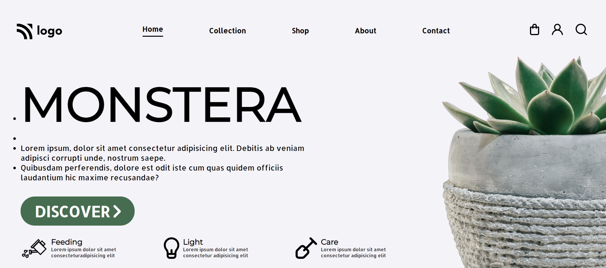

# Live Class Project6

Project- MONSTERA-Landing Page

This assignment was given as task in ineuron's FSJSBootCamp Course.

Technologies/ Tools Used:

- HTML
- CSS
- GitHub

&nbsp;&nbsp;&nbsp;

Click on the below given link to get the preview of the page

Learnings from this projects:-
* How to Use FontAwesome Icon in webpage.
* How to Add GoogleFonts to webpage.
* Different CSS properties.

&nbsp;

## Time Taken to complete this project was 3 days.
